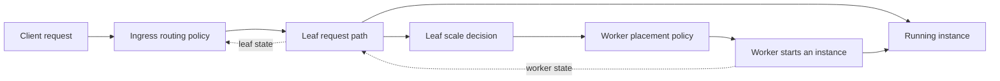

# Add a routing or placement policy

HyperFaaS makes two different choices: Ingress chooses a **leaf** for each
request. A leaf chooses a **worker** when it starts a new function instance.
A worker runs the instance. These choices happen at different times, so they
have separate interfaces.

A routing policy may want to keep requests for one function near its warm
instances. It may also need to avoid a "busy" leaf. These goals can pull in
different directions. Fuerst and Sharma study this choice for serverless
functions in [*Locality-aware Load-Balancing For Serverless Clusters*](https://doi.org/10.1145/3502181.3531459).
Chen, Coleman, and Shrivastava study how a full node can affect nearby nodes
in [*Revisiting Consistent Hashing with Bounded Loads*](https://doi.org/10.1609/aaai.v35i5.16517).




Both choices use recent state, but that state can be late. A policy must
handle a missing or unhealthy target. The leaf checks worker capacity again (to avoid concurrency issues)
after a placement choice and reserves a start slot. A placement choice alone
does not reserve capacity.

`PlatformConfig` selects one ingress policy and one placement policy for the
deployment.
You can change policies at runtime with TODO mention endpoint, you do not need to restart the cluster.
Do not change policies while you are running load tests or benchmarks, always stop your workloads first.

## How state reaches a policy

A policy sees only the state we send it. Some state is always sent. Anything
beyond that is an extra field, and it is sent only when the policy asks for it.

Ingress always receives leaf health. A leaf is healthy when it reports at
least one healthy worker. A placement policy always receives the worker state
used to track instances and capacity.

A policy asks for extra fields by returning them from `Needs()`. That return
value is a **projection**: the runtime computes and stores only those fields.
Each extra field is one enum on `RoutingNeeds` or `PlacementNeeds`. The enums
that already exist are listed in
[`pkg/ingress/routing/needs.go`](../pkg/ingress/routing/needs.go) and
[`pkg/leaf/scheduler/needs.go`](../pkg/leaf/scheduler/needs.go). Return the
enums the policy reads. Add a new enum only when none of the current fields is
enough to make the choice. For ingress, add the value to the leaf state the
leaf sends to ingress. For placement, add the value to the worker state the
worker sends to the leaf.

Leaf load is the highest normalized
worker load on a leaf. When an ingress policy asks for it, the leaf asks its
workers for load, including when the placement policy does not use load.

## Add an ingress routing policy

Ingress policy code is in [`pkg/ingress/routing/`](../pkg/ingress/routing/).
The smallest example is the round-robin policy in
[`stateless.go`](../pkg/ingress/routing/stateless.go). It needs only leaf health.
For a policy that reads leaf load, see
[`boundedloads.go`](../pkg/ingress/routing/boundedloads.go).

A new policy implements these three interfaces in the `routing` package:

```go
type routingPolicy interface {
    Needs() RoutingNeeds
    NewModel(Topology) routingModel
}

type routingModel interface {
    ReplaceLeaf(LeafState) UpdateResult
    Apply(LeafState) UpdateResult
    LeafDisconnected(uint64) UpdateResult
    Picker() Picker
}

type Picker interface {
    Pick(RouteRequest) (LeafTarget, error)
}
```

The **policy** defines what data is needed to make a choice and builds a model. The **model** receives
state updates. The **picker** makes the request-time choice. `RouteRequest`
has the user and function IDs. `LeafTarget` has the chosen leaf ID, address,
and reason.

The split keeps state updates away from the request path. Updates can use a
mutex. A picker must make each request choice without that mutex.

A frame is one message on a leaf's state stream. It carries that leaf's
routing state at one moment in time (also called a "revision"), and the controller uses it to update the model.
The first frame on a stream is a full snapshot. Each later frame is an update.
A full snapshot is needed first because whenever a leaf joins the cluster (or is restarted), we need to know the full state.
Frames make it possible to efficiently update the model with only deltas, avoiding the need to resend the entire state.
For example, the capacity list in a later frame includes only functions whose
capacity changed. For each one it sends the function id, the number of ready
instances, the available concurrency, and the number of in-flight requests. A
removed function is sent as its id with deleted set.

The routing controller, in
[`controller.go`](../pkg/ingress/routing/controller.go), is the ingress code
that reads each leaf's state stream and calls the model. It is not part of
the policy. It calls those updates under one mutex: `ReplaceLeaf` for the
full snapshot, `Apply` for each later frame, and `LeafDisconnected` when a
leaf stream ends. A disconnect changes health; it must not invent a new load
or capacity value.

Each update returns one of these values:

| Result | Meaning |
| --- | --- |
| `NoChange` | The picker would see no change. |
| `ChangedInPlace` | The model has made a value update safe for existing pickers. |
| `PublishPicker` | The controller must build and install a new picker. |

We use `PublishPicker` every time a leaf joins or leaves the set of healthy leaves. 
This is done to avoid having to filter for healthy leaves every time, as we assume that a leaf leaving the healthy set is a rare event.

Return `ChangedInPlace` when the model has already stored the new value. 
For example, one leaf's load is this kind of update: write the
new number into the same per-leaf place those pickers already read, and keep
the picker. Return `NoChange` when the new value is the same as the stored
one. The model chooses the result. The controller does not read the policy's
data to choose it.

`Pick` runs for every request. It must be thread safe.
It must not take the controller mutex or read a map or slice that the
model is changing.


To implement a new policy:

1. Add one case and its settings message to `RoutingPolicyConfig` in
   [`proto/core.proto`](../proto/core.proto). Run `just gen-proto` from the
   repository root.
2. Add the config case to `newRoutingPolicy` in
   [`model.go`](../pkg/ingress/routing/model.go). Add a stable name in
   [`policy.go`](../pkg/ingress/routing/policy.go).
3. Implement `routingPolicy`, `routingModel`, and `Picker` in a new file.
4. Return the needed fields from `Needs()`. The available fields are in
   [`needs.go`](../pkg/ingress/routing/needs.go).
5. If you add a leaf field, carry it through the leaf state producer and the
   ingress frame reader. The main files are
   [`proto/leaf.proto`](../proto/leaf.proto),
   [`pkg/leaf/state/routing.go`](../pkg/leaf/state/routing.go),
   [`pkg/leaf/state/reporter.go`](../pkg/leaf/state/reporter.go),
   [`pkg/leaf/server.go`](../pkg/leaf/server.go), and
   [`controller.go`](../pkg/ingress/routing/controller.go). If the field
   comes from worker state, update the projection in
   [`pkg/leaf/runtime/placement_controller.go`](../pkg/leaf/runtime/placement_controller.go)
   too.
6. Expose the policy name in the deployment tool that writes `PlatformConfig`.

## Add a worker placement policy

Placement code lives in [`pkg/leaf/scheduler/`](../pkg/leaf/scheduler/).
Start with [`balanced.go`](../pkg/leaf/scheduler/balanced.go) for a small
round-robin example. It also has a special fast path for start reservations.
For a policy that uses a normal worker snapshot, read
[`cold_start.go`](../pkg/leaf/scheduler/cold_start.go).

A placement policy implements one interface:

```go
type PlacementScheduler interface {
    PickWorker(
        ctx context.Context,
        function *core.FunctionSpec,
        workers []*core.WorkerState,
        demand *core.ScaleDemand,
    ) (*core.PlacementDecision, error)
}
```

Placement runs when the leaf starts an instance. The leaf can give it a
prepared worker snapshot, so it does not need a separate model and picker.

The leaf passes one `WorkerState` per worker on each placement call.
`instances` is the number of sandboxes on that worker, for every function.
The leaf adds starts it has reserved on that worker and the worker has not
reported yet. Those reserved starts are also `cold_starts_in_flight`. The
same snapshot carries the worker's health, whether it can accept work, its
resource capacity and current allocation, its load, and its cached images.

`PlacementDecision.reason` is a string the policy writes. There is no shared
enum. Use a stable name for the choice, such as `cold-start-aware` or
`image-aware-hit`. The leaf logs that string as `scheduler_reason` and does
not branch on it. When no worker is suitable, return worker ID zero and a
reason that says why, such as `no workers`. Return an error for a real failure.
You can then use the reason in logs to debug policies.

To implement a new policy:

1. Add one case and its settings message to `PlacementPolicyConfig` in
   [`proto/core.proto`](../proto/core.proto). Run `just gen-proto`.
2. Implement `PlacementScheduler` in a new file under `pkg/leaf/scheduler/`.
3. Add the config case to `NewFromConfig` and `PlacementPolicyLabel` in
   [`factory.go`](../pkg/leaf/scheduler/factory.go).
4. Add its worker state needs to `NeedsFor` in
   [`needs.go`](../pkg/leaf/scheduler/needs.go). Return zero when it needs
   only state that the leaf already has.
5. If it needs a new worker field, add that field to the worker state message,
   projection, producer, and leaf client. Start at
   [`proto/worker.proto`](../proto/worker.proto),
   [`proto/core.proto`](../proto/core.proto),
   [`pkg/worker/health.go`](../pkg/worker/health.go), and
   [`pkg/leaf/worker/client.go`](../pkg/leaf/worker/client.go).
6. Expose the policy name in the deployment tool that writes `PlatformConfig`.
